Exercise2
================
18 August 2018

Problem1
--------

Loading and cleaning data

``` r
ABIA=read.csv("../data/ABIA.csv")
ABIA$ArrDelay[is.na(ABIA$ArrDelay)] = 0
codes=read.csv("../data/airport-codes.csv")
codes1=codes[c('name','coordinates','iata_code')]
codes1=na.omit(codes1)
codes1=codes1[!duplicated(codes1[c('iata_code')]),]
ABIA$Week<- ABIA$DayOfWeek
ABIA$Week[ABIA$DayOfWeek == 1] <- 'Monday'
ABIA$Week[ABIA$DayOfWeek == 2] <- 'Tuesday'
ABIA$Week[ABIA$DayOfWeek == 3] <- 'Wednesday'
ABIA$Week[ABIA$DayOfWeek == 4] <- 'Thursday'
ABIA$Week[ABIA$DayOfWeek == 5] <- 'Friday'
ABIA$Week[ABIA$DayOfWeek == 6] <- 'Saturday'
ABIA$Week[ABIA$DayOfWeek == 7] <- 'Sunday'
ABIA$MonthQual<-ABIA$Month
ABIA$MonthQual[ABIA$MonthQual == 1] <- 'January'
ABIA$MonthQual[ABIA$MonthQual == 2] <- 'February'
ABIA$MonthQual[ABIA$MonthQual == 3] <- 'March'
ABIA$MonthQual[ABIA$MonthQual == 4] <- 'April'
ABIA$MonthQual[ABIA$MonthQual == 5] <- 'May'
ABIA$MonthQual[ABIA$MonthQual == 6] <- 'June'
ABIA$MonthQual[ABIA$MonthQual == 7] <-'July'
ABIA$MonthQual[ABIA$MonthQual == 8] <- 'August'
ABIA$MonthQual[ABIA$MonthQual == 9] <- 'September'
ABIA$MonthQual[ABIA$MonthQual == 10] <- 'October'
ABIA$MonthQual[ABIA$MonthQual == 11] <- 'November'
ABIA$MonthQual[ABIA$MonthQual == 12] <- 'December'

ABIA$CancellationCode1="No cancellation"
ABIA$CancellationCode1[ABIA$CancellationCode =='A']="Carrier"
ABIA$CancellationCode1[ABIA$CancellationCode == 'B'] = 'Weather'
ABIA$CancellationCode1[ABIA$CancellationCode == 'C'] = 'NAS'
ABIA$CancellationCode1[ABIA$CancellationCode == 'D'] = 'Security'

ABIA=merge(ABIA, codes1, by.x = "Dest", by.y = "iata_code")

ABIA$Dephr=substr(ABIA$DepTime,1,nchar(ABIA$DepTime)-2)
ABIA$Dephr[ABIA$Dephr == ''] = 0
ABIA$Dephr=as.numeric(ABIA$Dephr)

ABIA$Direction[ABIA$Dest=="AUS"]<-"To Aus"
ABIA$Direction[ABIA$Origin=="AUS"]<-"From Aus"
ABIA_notcancelled=ABIA[ABIA$Cancelled==0,]
```

``` r
library(ggplot2)
ggplot(ABIA_notcancelled, aes(Dephr)) + geom_bar(width=0.8,position="dodge",color="black")+
  labs(x = "Dephr", y = "Count",title = "#Flights to and from Austin")+
  theme(legend.text = element_text(colour="blue", size=10, 
                                   face="bold"))
```


``` r
FlighttofromAUS=table(ABIA_notcancelled$Direction,ABIA_notcancelled$Dephr)
barplot(FlighttofromAUS, main="Successful flights",
        xlab="Dep hr", col=c("orange","blue"),beside = TRUE,legend = rownames(FlighttofromAUS))
```


More traffic from 6AM-7PM

``` r
DF_Q1=cbind(aggregate(ArrDelay ~ Dephr+DayOfWeek, data = ABIA_notcancelled, FUN = function(x) c(mn = mean(x))),aggregate(ArrDelay ~ Dephr+Week, data = ABIA_notcancelled, FUN = function(x) c(mn = length(x))))
DF_Q1=DF_Q1[,c(1,2,3,6)]
colnames(DF_Q1)[3] <- "Avg_Arr_Delay"
colnames(DF_Q1)[4] <- "flights"
DF_Q1=na.omit(DF_Q1)
```

``` r
library(ggplot2)
require(viridis)
```

    ## Loading required package: viridis

    ## Loading required package: viridisLite

``` r
library(ggthemes)

ggplot(data = DF_Q1, aes(x=Dephr,y=as.factor(DayOfWeek))) + geom_tile(aes(fill=flights)) + scale_fill_viridis(option="magma")+xlab('Dephr')+theme_tufte(base_family="Helvetica")+ggtitle("No of Flights")+xlab("Time")
```

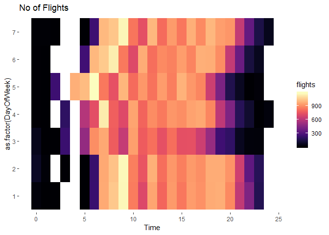

``` r
ggplot(data = DF_Q1, aes(x = Dephr ,y = as.factor(DayOfWeek))) + 
  geom_tile(aes(fill = Avg_Arr_Delay)) + 
  coord_equal(ratio = 1)+ scale_fill_viridis(option="magma") + theme_tufte(base_family="Helvetica")+ggtitle("Avg delay in minutes")+xlab("Departure time")
```

 Though there are very few flights during early mornings, avg delays tend to be longer for these flights

``` r
ABIA$CSRDephr_Correct = substr(ABIA$CRSDepTime,1,nchar(ABIA$CRSDepTime)-2)
ABIA$CSRDephr_Correct=as.numeric(ABIA$CSRDephr_Correct)
ABIA_cancelled=ABIA[ABIA$Cancelled==1,]
DF_Q1_1=aggregate(Year ~ CSRDephr_Correct+DayOfWeek, data = ABIA_cancelled, FUN = function(x) c(mn = length(x)))
colnames(DF_Q1_1)[3] <- "Cancellations"
ggplot(data = DF_Q1_1, aes(x=CSRDephr_Correct,y=as.factor(DayOfWeek))) + geom_tile(aes(fill=Cancellations))+ scale_fill_viridis(option="magma")+xlab('CSRDephr_Correct')+theme_tufte(base_family="Helvetica")+ggtitle("Cancelled flights")+xlab("Time")
```

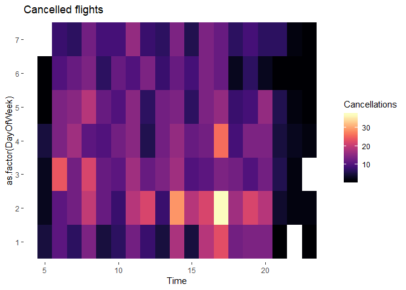

More cancellations on weekdays, specially tuesdays

``` r
DF_Q2=cbind(aggregate(ArrDelay ~ as.factor(Month), data = ABIA_notcancelled, FUN = function(x) c(mn = mean(x))),aggregate(ArrDelay ~ MonthQual, data = ABIA_notcancelled, FUN = function(x) c(mn = length(x))))
DF_Q2=DF_Q2[,c(1,2,4)]
colnames(DF_Q2)[2] <- "Avg_Arr_Delay"
colnames(DF_Q2)[3] <- "flights"
require(ggplot2)
ggplot(data = ABIA_notcancelled, aes(x=as.factor(Month), y=ArrDelay)) + geom_boxplot()+scale_y_continuous(limits=c(0,200), breaks=seq(0,200,20), expand = c(0, 0))
```

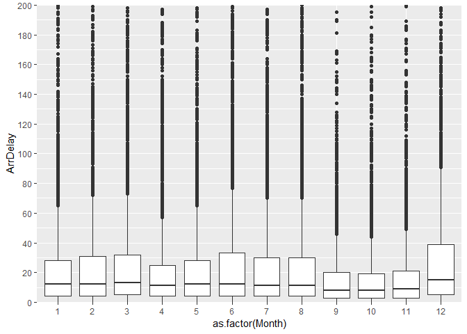 There are many outliers, more spread and the median arrival delays are almost same across all the months.

``` r
MoM_Cancellations= table(ABIA_cancelled$CancellationCode1,ABIA_cancelled$Month)
barplot(MoM_Cancellations, main="Cancelled flights",
        xlab="Month", col=c("orange","red","blue"),
        beside = TRUE,las=2,legend = rownames(MoM_Cancellations),args.legend = list(x = "topright",bty="n"))
```

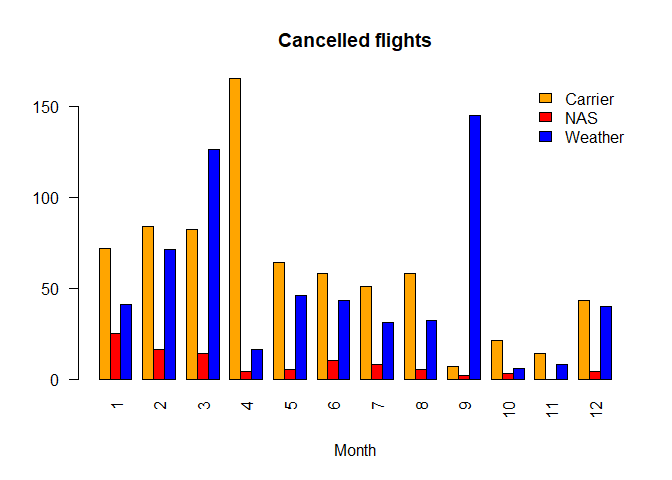

Majority of the flights cancelled during September month were because of bad weather.

``` r
Fromaustin=ABIA[ABIA$Origin=='AUS',]
Fromaustin$Type='Successful'
Fromaustin$Type[Fromaustin$Diverted == 1] = 'Diverted'
Fromaustin$Type[Fromaustin$Cancelled == 1] = 'Cancelled'

From_austin_successful=Fromaustin[Fromaustin$Type=='Successful',]
From_austin_successful=table(From_austin_successful$Type,From_austin_successful$Dest)
barplot(From_austin_successful, main="Successful flights",
        xlab="Destination", col=c("darkblue"),legend = rownames(From_austin_successful),beside = TRUE,srt=90,las=2)
```

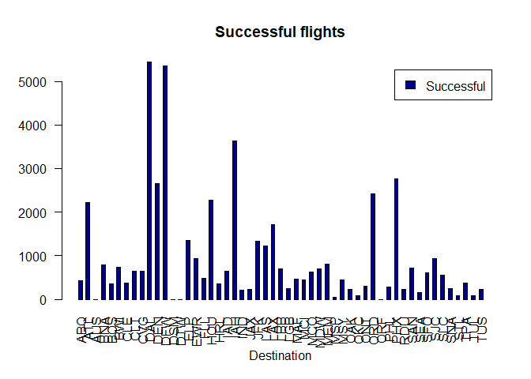

More traffic towards DAL,DFW,IAH,ORD, PHX,ATL

``` r
From_austin_failed=Fromaustin[Fromaustin$Type!='Successful',]
From_austin_failed=table(From_austin_failed$Type,From_austin_failed$Dest)
barplot(From_austin_failed, main="Cancelled/Diverted flights",
        xlab="Destination", col=c("orange","red"),
        legend = rownames(From_austin_failed),beside = TRUE,srt=90,las=2)
```

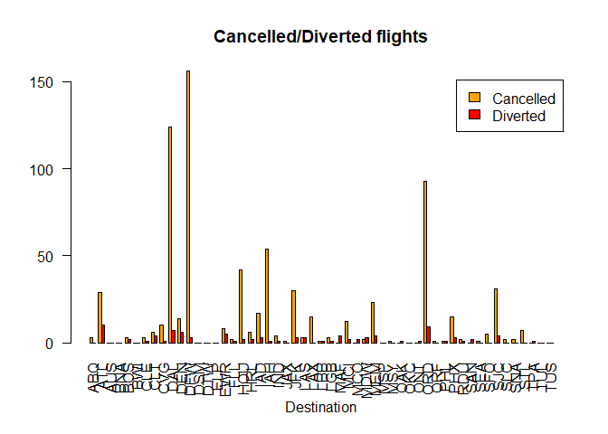

DAL,DFW,ORD have higher cancellations More cancelled flights than diverted flights

``` r
Fromaustin_cancelledsplit=Fromaustin[Fromaustin$Cancelled==1,]
Fromaustin_cancelledsplit= table(Fromaustin_cancelledsplit$CancellationCode1,Fromaustin_cancelledsplit$Dest)
barplot(Fromaustin_cancelledsplit, main="Cancelled flights",
        xlab="Destination", col=c("orange","red","blue"),
        beside = TRUE,las=2,legend = rownames(Fromaustin_cancelledsplit),args.legend = list(x = "topright"))
```

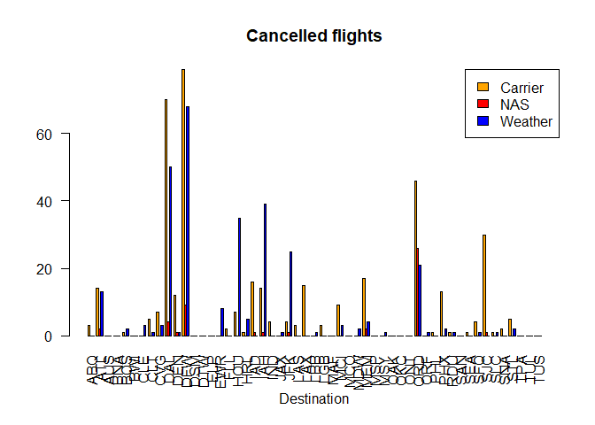

Most of the cancellations are due to Carrier or Weather. ORD and DFW have very high cancelled flights because of NAS, delay that is within the control of the National Airspace System (NAS) may include: non-extreme weather conditions, airport operations, heavy traffic volume, air traffic control, etc

``` r
DF_Q4_1=aggregate(Year ~ name+Month, data = ABIA_cancelled[ABIA_cancelled$Origin=='AUS',], FUN = function(x) c(mn = length(x)))
colnames(DF_Q4_1)[3] <- "Monthly_Cancellations"
ggplot(data = DF_Q4_1, aes(x=as.factor(Month),y=name)) + geom_tile(aes(fill=Monthly_Cancellations))+ scale_fill_viridis(option="magma")+xlab('CSRDephr_Correct')+theme_tufte(base_family="Helvetica")+ggtitle("Cancelled flights")+xlab("Month")
```

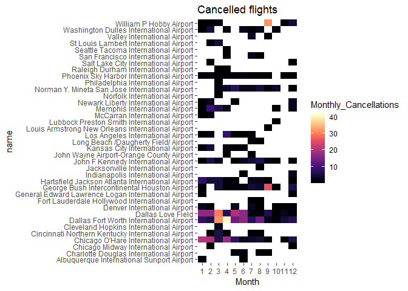

DL and DFW airorts had many cancellations in the first half year, the numbers improved great deal in the later part of the year

You can see that William P Hobby aiport and George Bush International airpoprts had more cancellations in September that increased the overall cancellations due to bad weather for the month. This is because of Hurrican Ike, tropical cyclone , sixth costliest Atlantic hurraine that severely affected Texas

Problem3
--------

We have multiple baskets of grocery items and will find some interesting association rules using the items in these baskets. This is how the data looks like after reading from the text file:

``` r
groceries = scan("../data/groceries.txt", what="", sep="\n")
print(paste("number of baskets = ", length(groceries)))
```

    ## [1] "number of baskets =  9835"

``` r
head(groceries)
```

    ## [1] "citrus fruit,semi-finished bread,margarine,ready soups"             
    ## [2] "tropical fruit,yogurt,coffee"                                       
    ## [3] "whole milk"                                                         
    ## [4] "pip fruit,yogurt,cream cheese ,meat spreads"                        
    ## [5] "other vegetables,whole milk,condensed milk,long life bakery product"
    ## [6] "whole milk,butter,yogurt,rice,abrasive cleaner"

Transforming the data to make it readable in a transaction format accepted by arules package:

``` r
y = strsplit(groceries, ",")
gro_trans = as(y, "transactions")
summary(gro_trans)
```

    ## transactions as itemMatrix in sparse format with
    ##  9835 rows (elements/itemsets/transactions) and
    ##  169 columns (items) and a density of 0.02609146 
    ## 
    ## most frequent items:
    ##       whole milk other vegetables       rolls/buns             soda 
    ##             2513             1903             1809             1715 
    ##           yogurt          (Other) 
    ##             1372            34055 
    ## 
    ## element (itemset/transaction) length distribution:
    ## sizes
    ##    1    2    3    4    5    6    7    8    9   10   11   12   13   14   15 
    ## 2159 1643 1299 1005  855  645  545  438  350  246  182  117   78   77   55 
    ##   16   17   18   19   20   21   22   23   24   26   27   28   29   32 
    ##   46   29   14   14    9   11    4    6    1    1    1    1    3    1 
    ## 
    ##    Min. 1st Qu.  Median    Mean 3rd Qu.    Max. 
    ##   1.000   2.000   3.000   4.409   6.000  32.000 
    ## 
    ## includes extended item information - examples:
    ##             labels
    ## 1 abrasive cleaner
    ## 2 artif. sweetener
    ## 3   baby cosmetics

Few points to note from the summary:
1. Presenece of 169 different items in all the transactions combined.
2. Whole milk, other vegetables, rolls/buns are the most frequently bought items.
3. 2159 out of 9835 transactions have only one item in the cart.
4. 75% transactions have less than 6 items in the cart.

Now we will run the apriori algorithm to get the rules from these transactions. In order to select threshold for support, let us consider itemsets which appear atleast in 50 baskets out of 9835. That converts to a support threshold of (50/9835) = 0.005. Threshold for confidence will be fixed at 0.2 to ensure that atleast 1 of 5 baskets that contain X also have Y in them(for the rule X -&gt; Y). Also we put in the paramenter minlen = 2 to avoid rules with NULL value of X.

``` r
groceryrules = apriori(gro_trans, 
                     parameter=list(support=0.005, confidence=.2, minlen=2))
```

    ## Apriori
    ## 
    ## Parameter specification:
    ##  confidence minval smax arem  aval originalSupport maxtime support minlen
    ##         0.2    0.1    1 none FALSE            TRUE       5   0.005      2
    ##  maxlen target   ext
    ##      10  rules FALSE
    ## 
    ## Algorithmic control:
    ##  filter tree heap memopt load sort verbose
    ##     0.1 TRUE TRUE  FALSE TRUE    2    TRUE
    ## 
    ## Absolute minimum support count: 49 
    ## 
    ## set item appearances ...[0 item(s)] done [0.00s].
    ## set transactions ...[169 item(s), 9835 transaction(s)] done [0.01s].
    ## sorting and recoding items ... [120 item(s)] done [0.00s].
    ## creating transaction tree ... done [0.00s].
    ## checking subsets of size 1 2 3 4 done [0.01s].
    ## writing ... [872 rule(s)] done [0.00s].
    ## creating S4 object  ... done [0.00s].

This created 872 rules. Let us plot these rules. 

It is observed that rules with high lift have low support.

Looking at the two-key plot for studying the variations in rules with size of itemset:
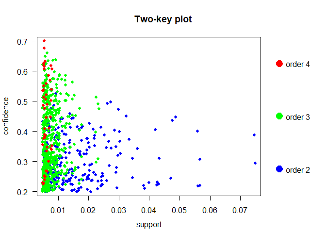

All the rules of higher order have low support and itemsets of lower order have low confidence. Lets examine these rules.

#### Rules with high lift

``` r
inspect(subset(groceryrules, lift > 3.5))
```

    ##      lhs                     rhs                      support confidence     lift count
    ## [1]  {herbs}              => {root vegetables}    0.007015760  0.4312500 3.956477    69
    ## [2]  {berries}            => {whipped/sour cream} 0.009049314  0.2721713 3.796886    89
    ## [3]  {onions,                                                                          
    ##       other vegetables}   => {root vegetables}    0.005693950  0.4000000 3.669776    56
    ## [4]  {beef,                                                                            
    ##       other vegetables}   => {root vegetables}    0.007930859  0.4020619 3.688692    78
    ## [5]  {curd,                                                                            
    ##       tropical fruit}     => {yogurt}             0.005287239  0.5148515 3.690645    52
    ## [6]  {domestic eggs,                                                                   
    ##       whole milk}         => {butter}             0.005998983  0.2000000 3.609174    59
    ## [7]  {butter,                                                                          
    ##       other vegetables}   => {whipped/sour cream} 0.005795628  0.2893401 4.036397    57
    ## [8]  {other vegetables,                                                                
    ##       whipped/sour cream} => {butter}             0.005795628  0.2007042 3.621883    57
    ## [9]  {whipped/sour cream,                                                              
    ##       whole milk}         => {butter}             0.006710727  0.2082019 3.757185    66
    ## [10] {citrus fruit,                                                                    
    ##       pip fruit}          => {tropical fruit}     0.005592272  0.4044118 3.854060    55
    ## [11] {citrus fruit,                                                                    
    ##       tropical fruit}     => {pip fruit}          0.005592272  0.2806122 3.709437    55
    ## [12] {other vegetables,                                                                
    ##       whole milk,                                                                      
    ##       yogurt}             => {whipped/sour cream} 0.005592272  0.2511416 3.503514    55
    ## [13] {other vegetables,                                                                
    ##       pip fruit,                                                                       
    ##       whole milk}         => {root vegetables}    0.005490595  0.4060150 3.724961    54
    ## [14] {citrus fruit,                                                                    
    ##       other vegetables,                                                                
    ##       whole milk}         => {root vegetables}    0.005795628  0.4453125 4.085493    57
    ## [15] {root vegetables,                                                                 
    ##       whole milk,                                                                      
    ##       yogurt}             => {tropical fruit}     0.005693950  0.3916084 3.732043    56
    ## [16] {other vegetables,                                                                
    ##       tropical fruit,                                                                  
    ##       whole milk}         => {root vegetables}    0.007015760  0.4107143 3.768074    69

#### Rules with low confidence and high support rules.

``` r
inspect(subset(groceryrules, support > 0.025 & confidence < 0.35))
```

    ##      lhs                   rhs                support    confidence
    ## [1]  {newspapers}       => {whole milk}       0.02735130 0.3426752 
    ## [2]  {pip fruit}        => {other vegetables} 0.02613116 0.3454301 
    ## [3]  {citrus fruit}     => {other vegetables} 0.02887646 0.3488943 
    ## [4]  {sausage}          => {rolls/buns}       0.03060498 0.3257576 
    ## [5]  {sausage}          => {other vegetables} 0.02694459 0.2867965 
    ## [6]  {sausage}          => {whole milk}       0.02989324 0.3181818 
    ## [7]  {bottled water}    => {soda}             0.02897814 0.2621895 
    ## [8]  {bottled water}    => {whole milk}       0.03436706 0.3109476 
    ## [9]  {tropical fruit}   => {yogurt}           0.02928317 0.2790698 
    ## [10] {yogurt}           => {tropical fruit}   0.02928317 0.2099125 
    ## [11] {tropical fruit}   => {other vegetables} 0.03589222 0.3420543 
    ## [12] {root vegetables}  => {yogurt}           0.02582613 0.2369403 
    ## [13] {other vegetables} => {root vegetables}  0.04738180 0.2448765 
    ## [14] {soda}             => {rolls/buns}       0.03833249 0.2198251 
    ## [15] {rolls/buns}       => {soda}             0.03833249 0.2084024 
    ## [16] {soda}             => {whole milk}       0.04006101 0.2297376 
    ## [17] {yogurt}           => {rolls/buns}       0.03436706 0.2463557 
    ## [18] {yogurt}           => {other vegetables} 0.04341637 0.3112245 
    ## [19] {other vegetables} => {yogurt}           0.04341637 0.2243826 
    ## [20] {whole milk}       => {yogurt}           0.05602440 0.2192598 
    ## [21] {rolls/buns}       => {other vegetables} 0.04260295 0.2316197 
    ## [22] {other vegetables} => {rolls/buns}       0.04260295 0.2201787 
    ## [23] {rolls/buns}       => {whole milk}       0.05663447 0.3079049 
    ## [24] {whole milk}       => {rolls/buns}       0.05663447 0.2216474 
    ## [25] {whole milk}       => {other vegetables} 0.07483477 0.2928770 
    ##      lift      count
    ## [1]  1.3411103 269  
    ## [2]  1.7852365 257  
    ## [3]  1.8031403 284  
    ## [4]  1.7710480 301  
    ## [5]  1.4822091 265  
    ## [6]  1.2452520 294  
    ## [7]  1.5035766 285  
    ## [8]  1.2169396 338  
    ## [9]  2.0004746 288  
    ## [10] 2.0004746 288  
    ## [11] 1.7677896 353  
    ## [12] 1.6984751 254  
    ## [13] 2.2466049 466  
    ## [14] 1.1951242 377  
    ## [15] 1.1951242 377  
    ## [16] 0.8991124 394  
    ## [17] 1.3393633 338  
    ## [18] 1.6084566 427  
    ## [19] 1.6084566 427  
    ## [20] 1.5717351 551  
    ## [21] 1.1970465 419  
    ## [22] 1.1970465 419  
    ## [23] 1.2050318 557  
    ## [24] 1.2050318 557  
    ## [25] 1.5136341 736

Items in these rules are the most frequently bought items as we saw from the summary of transactions. This explains the high support of these rules and low confidence.

#### Rules with high confidence and high support:

``` r
inspect(subset(groceryrules, support > 0.025 & confidence > 0.35))
```

    ##      lhs                        rhs                support    confidence
    ## [1]  {curd}                  => {whole milk}       0.02613116 0.4904580 
    ## [2]  {brown bread}           => {whole milk}       0.02521607 0.3887147 
    ## [3]  {butter}                => {whole milk}       0.02755465 0.4972477 
    ## [4]  {domestic eggs}         => {whole milk}       0.02999492 0.4727564 
    ## [5]  {fruit/vegetable juice} => {whole milk}       0.02663955 0.3684951 
    ## [6]  {whipped/sour cream}    => {other vegetables} 0.02887646 0.4028369 
    ## [7]  {whipped/sour cream}    => {whole milk}       0.03223183 0.4496454 
    ## [8]  {pip fruit}             => {whole milk}       0.03009659 0.3978495 
    ## [9]  {pastry}                => {whole milk}       0.03324860 0.3737143 
    ## [10] {citrus fruit}          => {whole milk}       0.03050330 0.3685504 
    ## [11] {tropical fruit}        => {whole milk}       0.04229792 0.4031008 
    ## [12] {root vegetables}       => {other vegetables} 0.04738180 0.4347015 
    ## [13] {root vegetables}       => {whole milk}       0.04890696 0.4486940 
    ## [14] {yogurt}                => {whole milk}       0.05602440 0.4016035 
    ## [15] {other vegetables}      => {whole milk}       0.07483477 0.3867578 
    ##      lift     count
    ## [1]  1.919481 257  
    ## [2]  1.521293 248  
    ## [3]  1.946053 271  
    ## [4]  1.850203 295  
    ## [5]  1.442160 262  
    ## [6]  2.081924 284  
    ## [7]  1.759754 317  
    ## [8]  1.557043 296  
    ## [9]  1.462587 327  
    ## [10] 1.442377 300  
    ## [11] 1.577595 416  
    ## [12] 2.246605 466  
    ## [13] 1.756031 481  
    ## [14] 1.571735 551  
    ## [15] 1.513634 736

#### Rules on network graph

``` r
sub1 = subset(groceryrules, subset=support > 0.025 & confidence > 0.35)
plot(sub1, method='graph')
```

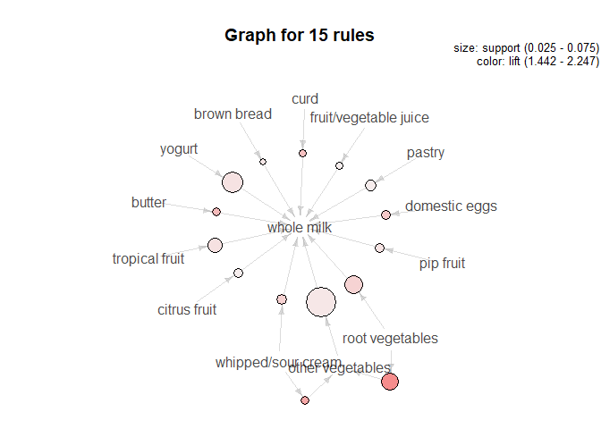

``` r
plot(head(sub1, 5, by='lift'), method='graph')
```

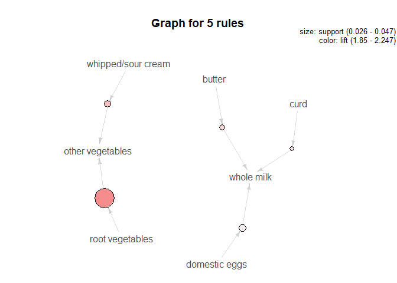
